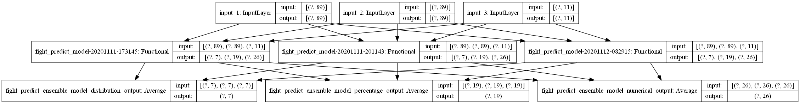

# Weighted UFC Fight Predictor
Use enhanced methods of feature engineering and construct deep machine learning model to predict the UFC fight statistics result in detail
## Prediction results & Abstract on main Technique
* One example result of evaluate ensemble model on test dataset :

        {
            "loss": 3.3663954734802246,
            "fight_predict_ensemble_model_distribution_output_loss": 0.701763391494751,
            "fight_predict_ensemble_model_percentage_output_loss": 0.623022198677063,
            "fight_predict_ensemble_model_numerical_output_loss": 0.27584293484687805,
            "fight_predict_ensemble_model_distribution_output_accuracy": 0.8292058110237122,
            "fight_predict_ensemble_model_distribution_output_overall_accuracy": 0.8573868274688721,
            "fight_predict_ensemble_model_distribution_output_overall_force_pick_accuracy": 0.8467122316360474,
            "fight_predict_ensemble_model_percentage_output_masked_mae_accuracy": 0.17389175295829773,
            "fight_predict_ensemble_model_numerical_output_masked_mae_accuracy": 1.228183388710022
        }

* One example plots value over epoch during training, ***train(Red)/verification(Green)***:
    <table>
    <tr>
    <td>7 outputs accuracy</td>
    <td>3 outputs overall_accuracy</td>
    <td>3 outputs overall_force_pick_accuracy</td>
    </tr>
    <tr>
    <td> </td>
    <td></td>
    <td></td>
    </tr>
    <tr>
    <td>26 numerical outputs MAE</td>
    <td>19 percentage outputs MAE</td>
    </tr>
    <tr>
    <td></td>
    <td> </td>
    </tr>
    </table>

* One example predict:

        # Fighters_0 = [Khabib Nurmagomedov, Justin Gaethje] Fighters_1 = [Georges St-Pierre, Conor McGregor]
        # Khabib Nurmagomedov VS Georges St-Pierre and Justin Gaethje VS Conor McGregor
        {
            "TKO_WIN_%_D_TAR_0": [
                0.018855955451726913,
                0.0015239701606333256
            ],
            "TKO_WIN_%_D_TAR_1": [
                0.002628082875162363,
                0.4555078446865082    # Conor McGregor win by KO/TKO
            ],
            "SUB_WIN_%_D_TAR_0": [
                0.49178606271743774,  # Khabib Nurmagomedov win by submission
                0.003942216746509075
            ],
            "SUB_WIN_%_D_TAR_1": [
                0.09372948110103607,
                0.028019540011882782
            ],
            "DEC_WIN_%_D_TAR_0": [
                0.30452772974967957,
                0.019140129908919334
            ],
            "DEC_WIN_%_D_TAR_1": [
                0.08724634349346161,
                0.48894381523132324
            ],
            "DEC_DRAW_%_D_TAR_2": [
                0.0012263769749552011,
                0.0029224955942481756
            ],
            "SIG_STR_%_P_TAR_0": [
                0.47973644733428955,
                0.38478678464889526
            ],
            "SIG_STR_%_P_TAR_1": [
                0.4234834611415863,
                0.4939485490322113 # Conor McGregor nearly 50% significant striking accuracy
            ],
            "TOTAL_STR_%_P_TAR_0": [
                0.5588271617889404,
                0.44314974546432495
            ],
            "TOTAL_STR_%_P_TAR_1": [
                0.507739782333374,
                0.5454508066177368
            ],
            "TD_%_P_TAR_0": [
                0.4940500259399414, # Khabib Nurmagomedov nearly 50% takedown accuracy
                0.2591354250907898
            ],
            "TD_%_P_TAR_1": [
                0.3813019394874573,
                0.485202431678772
            ],
            "HEAD_%_P_TAR_0": [
                0.3956388831138611,
                0.28784847259521484
            ],
            "HEAD_%_P_TAR_1": [
                0.3242433965206146,
                0.4244728088378906
            ],
            "BODY_%_P_TAR_0": [
                0.6927289366722107,
                0.6237716674804688
            ],
            "BODY_%_P_TAR_1": [
                0.652218222618103,
                0.702499270439148
            ],
            "LEG_%_P_TAR_0": [
                0.8070068359375,
                0.7762691974639893
            ],
            "LEG_%_P_TAR_1": [
                0.7821207046508789,
                0.8288556933403015
            ],
            "DISTANCE_%_P_TAR_0": [
                0.3954578638076782,
                0.3448685109615326
            ],
            "DISTANCE_%_P_TAR_1": [
                0.3588932752609253,
                0.418337345123291
            ],
            "CLINCH_%_P_TAR_0": [
                0.6884596347808838,
                0.6298392415046692
            ],
            "CLINCH_%_P_TAR_1": [
                0.6621456146240234,
                0.6730318069458008
            ],
            "GROUND_%_P_TAR_0": [
                0.7203129529953003,
                0.6515354514122009
            ],
            "GROUND_%_P_TAR_1": [
                0.6871642470359802,
                0.7184233665466309
            ],
            "FIGHT_MINUTE_P_TAR_2": [
                0.6628755331039429,     # Fight likely end in round 4
                0.6443588137626648
            ],
            "KD_N_TAR_0": [
                0.0,
                0.0
            ],
            "KD_N_TAR_1": [
                0.0,
                0.0
            ],
            "CTRL_N_TAR_0": [
                0.2795903980731964,
                0.09721415489912033
            ],
            "CTRL_N_TAR_1": [
                0.20967906713485718,
                0.22527733445167542
            ],
            "REV_N_TAR_0": [
                0.0,
                0.0
            ],
            "REV_N_TAR_1": [
                0.0,
                0.0
            ],
            "SUB_ATT_N_TAR_0": [
                0.0,
                0.0
            ],
            "SUB_ATT_N_TAR_1": [
                0.017563339322805405,
                0.009907504543662071
            ],
            "SIG_STR_N_TAR_0": [
                6.956855773925781,
                7.700923442840576
            ],
            "SIG_STR_N_TAR_1": [
                5.8716583251953125,
                13.583786010742188
            ],
            "TOTAL_STR_N_TAR_0": [
                9.085978507995605,
                8.627628326416016
            ],
            "TOTAL_STR_N_TAR_1": [
                7.455966472625732,
                15.579353332519531
            ],
            "TD_N_TAR_0": [
                0.40830904245376587,
                0.46095019578933716
            ],
            "TD_N_TAR_1": [
                0.39187222719192505,
                0.3716878294944763
            ],
            "HEAD_N_TAR_0": [
                5.447246551513672,
                5.96542501449585
            ],
            "HEAD_N_TAR_1": [
                4.5015058517456055,
                11.297475814819336
            ],
            "BODY_N_TAR_0": [
                1.0024008750915527,
                1.1166326999664307
            ],
            "BODY_N_TAR_1": [
                0.9023560285568237,
                1.6174286603927612
            ],
            "LEG_N_TAR_0": [
                0.7570849657058716,
                0.9917914271354675
            ],
            "LEG_N_TAR_1": [
                0.7891854047775269,
                1.1353216171264648
            ],
            "DISTANCE_N_TAR_0": [
                5.170804500579834,
                7.14656400680542
            ],
            "DISTANCE_N_TAR_1": [
                4.790334224700928,
                9.43560791015625
            ],
            "CLINCH_N_TAR_0": [
                0.8629059791564941,
                0.8127731680870056
            ],
            "CLINCH_N_TAR_1": [
                0.7865716814994812,
                1.9877636432647705
            ],
            "GROUND_N_TAR_0": [
                1.4952468872070312,
                0.2971571385860443
            ],
            "GROUND_N_TAR_1": [
                0.878318727016449,
                3.394411087036133
            ]
        }

If one simply made the MLP(multilayer perceptron) a classification model and feed in fighter's normalized average statistics attributes (e.g average striking accuracy) then the best overall classification accuracy one can get is around **70%** (i.e better than picking favourite given around **60%** chance of winning), yet model trained in this work given overall classification accuracy around **80%** on test dataset(when sample test dataset evenly using chunks uniform sample method, test overall classification accuracy usually above **80%**, ensemble model can reach even higher overall classification accuracy on test dataset around **85%**, verification overall classification accuracy when training usually in range of **75%-80%** due to uneven sampling of verification dataset), this work are better than just simple deep classification model mainly due to three key components:

1. Calculate weighted statistics attributes for each fighter from they past fight in recursive fashion, **use fighter's attributes relevant to other fighter's attributes to approximate they true ability**, i.e fighter's ability is depending on they opponent's ability, e.g if both fighter have same striking accuracy from they past fight usually not mean they have same striking ability, who is better is depending on they opponent's defending ability. process like simply average the value will loss those important information, and this is crucial, because many belive that better data beat state-of-the-art algorithm.

2. Specially designed MLP structure and fight dataset doubling & switch process to **make fighter's attributes input position irrelevant to model's predict results**, e.g change fighter's coner position or glove color would have no effect on who will win the fight, should only switch the winner's coner position or glove color, lot of other UFC fight predictor model on internet using this misleading information when training the model in order to reach higher number on test accuracy, which will misleading model and reduces its general performance, remove this disturbance source is good for model to pay more attention on things that really matter.

3. Mixed model objective that **make MLP a classification & regression model** can learn and predict the fight in detail, we want not only the model can simply give us the overall classification on who will win the fight, but also give us some more detail! e.g how much probability one fighter may win specific opponent by KO/TKO or submission or decisions respectively? what is one fighter's takedown accuracy over specific opponent? Another benefit about make model predict fight in detail is it will force model learn data's pattern in detail which make overall classification more general.

## Usage and Files details
* Main package used: Scrapy V2.4.0, Pandas V1.1.3, Numpy V1.18.5, Tensorflow V2.3.1
* Run code in follow order to training new model: [Data Gathering](Code/Data_Gathering) -> [Reformat Raw Data](Code/Feature_Engineering/ReformatRawData.py) -> [Build Fight Data](Code/Feature_Engineering/BuildFightData_DCD_Include_NC.py) -> [ML Modeling](Code/ML_Modeling); Run scraper using cmd: `Scrapy runspider ./Code/Data_Gathering/[spider script name]`, Run all scripts directly in project root path 
* Settings for build features/labels dataset and models are located at [Settings.py](Code/Settings.py), change build_settings parameters in settings to build features for model to predict, constructed train/verification dataset located at [FightAllTrainData.csv](Data/FightAllTrainData.csv), constructed test dataset located at [FightAllTestData.csv](Data/FightAllTestData.csv), constructed features for predict located at [FightNeedPredictData.csv](Data/FightNeedPredictData.csv)
* [Logs directory](logs) store the information of model training, evaluation and predict result, using `tensorboard --logdir logs/fit` to tracking the training dynamic, go to [evaluate directory](logs/evaluate) to check models evaluate result on test dataset, predict result located at [predict directory](logs/predict)
* *Loss functions and Metrics* used can be find in [FightPredictor_Common.py](Code/ML_Modeling/FightPredictor_Common.py)
* [Saved models directory](saved_models) store the trained models and they structure diagram, subdirectory is list of folder with model's name, each model's name is identified by the type of the model and time it was created
* This work also try the three different label settings when build data, the last adopted one is [BuildFightData_DCD_Include_NC.py](Code/Feature_Engineering/BuildFightData_DCD_Include_NC.py), consider no-contest as same category as decision-draw which lead to better overall_accuracy, other two is [BuildFightData_Have_NC_And_DCD.py](Code/Feature_Engineering/BuildFightData_Have_NC_And_DCD.py): separate decision-draw/no-contest and [BuildFightData_Have_NC_And_DCD.py](Code/Feature_Engineering/BuildFightData_Have_NC_And_DCD.py): don't have both decision-draw/no-contest
* [MergeData.py](Code/Feature_Engineering/MergeData.py) using to merge scraped data from different site
* *Data/fighter_build_info.pickle*: store the fighter's latest calculated attributes, using to build new fight's input features for predict new fight
* *Data/normalize_parameters.pickle*: store mean and max range(max minus min) for featurs that need to normalize before feed to model

## Technical Details
* ### [Data Gathering](Code/Data_Gathering): 
    * Gathering UFC fights and fighters data using [Scrapy](https://scrapy.org/) from two website: [ufcstats](http://www.ufcstats.com/statistics/events/completed), [tapology](https://www.tapology.com)

* ### [Feature Engineering](Code/Feature_Engineering):
    * [Reformat Raw Data](Code/Feature_Engineering/ReformatRawData.py): Filter useful data in raw data, change number from string to correspond float or int, change category description to correspond abbreviation(e.g Submission -> SUB), change date format to %Y-%m-%d, change feet, inchs to centimeters, set missing data to np.nan, etc
    * [Build Fight Data](Code/Feature_Engineering/BuildFightData_DCD_Include_NC.py): Build features and labels of fight data from reformated data for training and testing model, or build features for model to predict. Most important one type of features is **weighted relative accuracy**:

        ```python
        # e.g calculate fighter_0's weighted relative striking accuracy(wrsa) & fighter_1's weighted relative defending accuracy(wrda), 
        # in order to approximate true ability of fighter_0's striking and fighter_0's defending, vice versa
        now_target_wrsa = striks_land_num / total_striks_num
        now_expect_wrsa = (last_wrsa + (1 - last_wrda)) / 2
        max_update_value = now_target_wrsa - now_expect_wrsa

        # fighter_0's wrsa change percentage is determining by ratio between fighter_0's striking number per minute,
        # and current fight to sum of fighter_0's striking number per minute in fighter_0's all fight
        sum_all_striking_num_per_minute = last_all_striking_num_per_minute + now_striking_num_per_minute
        change_percent_wrsa = now_striking_num_per_minute / sum_all_striking_num_per_minute
        new_wrsa = (last_wrsa + max_update_value) * change_percent_wrsa + (1 - change_percent_wrsa) * last_wrsa

        # fighter_1's wrda change percentage is determining by ratio between fighter_0's striking number per minute,
        # and current fight to sum of fighter_1's opponents striking number per minute in fighter_1's all last fight
        sum_all_defending_num_per_minute = last_all_defending_num_per_minute + now_defending_num_per_minute
        change_percent_wrda = now_defending_num_per_minute / sum_all_defending_num_per_minute    
        new_wrda = (last_wrda + max_update_value) * change_percent_wrda + (1 - change_percent_wrda) * last_wrda
        ```
        When split dataset into train/test dataset, beside simply uniformly sample from dataset, this work also provide other chunks uniform sample method, first divide dataset(fight ordered by date of fight) to chunks with specified size, then uniformly sample within each chunks, then combine all samples, by doing so one can get test dataset more uniformly distributed with respect to time of fight happened.

        Doubling & switch process can help to make fighter's attributes input position irrelevant to model's predict results, what this process did just duplicate the entire fight dataset and switch position of fighter_0 and fighter_1's data(for both features and labels), i.e **0 <=> 1**, e.g features: **`TD_DEF_W_0` <=> `TD_DEF_W_1`**, labels: **`SIG_STR_N_TAR_0` <=> `SIG_STR_N_TAR_1`**, etc.

        This work using *Mean normalization* for feature scaling, i.e `x_new = (x - mean) / (x_max - x_min)`, then set all missing features in rescaled features to zero, which is average value in rescaled features.

* ### [ML Modeling](Code/ML_Modeling):
    * **Model Inputs**: One complete model input data point contain one Fight Features and two Fighter Features(same features type and shape), way to distinguish two fighter features by `_0` or `_1`, e.g `TKO_WIN_%_0` or `TKO_WIN_%_1`
        * **Fighter Features**: 
            * `TKO_WIN_%, SUB_WIN_%, DEC_WIN_%, TKO_LOSS_%, SUB_LOSS_%, DEC_LOSS_%, DEC_DRAW_%` : Fighter's average KO/TKO, submission, decision percentage from fighter's past fights to win, loss, draw/no-contest respectively
            * `AGE` : Fight date minus fighter's day of birth
            * `REACH, HEIGHT` : Fighter's arm span and height in centimeters, normalized before input to model
            * `FIGHT_COUNT, FIGHT_MINUTE` : Fighter's number of past fights and sum of past fights minutes, normalized before input to model
            * `STANCE_ORT, STANCE_SOU, STANCE_SWI` : Fighter's stance, Orthodox, Southpaw, Switch, 1 if fighter have corresponding stance else 0, all 0 for unkonw stance
            * `REV_I, REV_P` : Fighter's average reversal and been reversal number per fight from fighter's past fights
            * **COSA**(Common Offensive Statistics Attributes):
                * `KD` : Knock down
                * `SIG_STR, TOTAL_STR` : Significant striking and Total striking
                * `TD` : Takedown
                * `SUB_ATT` : Submission attempt
                * `CTRL` : Center control time
                * `HEAD, Body, LEG` : Significant striking to head, body ,leg 
                * `DISTANCE, CLINCH, GROUND` : Striking when at distance, clinch, ground
            * **CDSA**(Common Defensive Statistics Attributes) : `[COSA]_DEF`, e.g TD_DEF for Takedown defence
            * `[COSA | CDSA]_W` : Weighted relative accuracy for corresponding attributes with respect to fighter's past fight, e.g SIG_STR_W for significant striking weighted relative accuracy
            * `[COSA | CDSA]_AVG` : Average accuracy for corresponding attributes with respect to fighter's past fight, e.g TOTAL_STR_AVG for total striking average accuracy
            * `[COSA | CDSA]_PM` : Average number per minute for corresponding attributes with respect to fighter's past fight, e.g SUB_ATT_PM for Average number of submission attempt per minute
        * **Fight Features**:
            * `MAX_FIGHT_TIME` : Maximum minutes the fight can go, normalized before input to model
            * `WOMEN, STR, FLY, BAN, FEA, LIG, WEL, MID, LIGHEA, HEA` : Shortening for corresponding weight class, again 1 if corresponding else 0, `WOMEN` determining fighter's gender 1 if is fight between women, or man 0

    * **Model Outputs**: Distinguish from input features by `_TAR`, depanding on what the main goal is, one can change the `losses_weight` in [Settings.py](Code/Settings.py) to make model focus on some objective over other
        * **Distribution Output**: Distinguish from other outputs by `_D`, output activation function using *softmax*, training using ***categorical_crossentropy***, 
            * `TKO_WIN_%_D_TAR`, `SUB_WIN_%_D_TAR`, `DEC_WIN_%_D_TAR` : Prediction on KO/TKO, submission, decision win probability for both fighter 
            * `DEC_DRAW_%_D_TAR_2` : Probability of fight end up decision-draw/no-contest, useful to see how confindent the model is in its prediction
        * **Percentage Output**: Distinguish from other outputs by `_P`, output activation function using *sigmoid*, training using ***masked_binary_crossentropy***, mask ignore missing predict/label pair
            * `SIG_STR_%_P, TOTAL_STR_%_P, TD_%_P, HEAD_%_P, BODY_%_P, LEG_%_P, DISTANCE_%_P, CLINCH_%_P, GROUND_%_P` : Prediction on percentage of action fighter execute will success, e.g SIG_STR_%_P_0 for fighter_0's significant striking accuracy in fight
            * `FIGHT_MINUTE_P_TAR` : Prediction on percentage of fight will last
        * **Numerical Output**: Distinguish from other outputs by `_N`,  output activation function using *relu*, training using ***masked_r2_loss***, mask ignore missing predict/label pair
            * `KD_N_TAR, SIG_STR_N_TAR, TOTAL_STR_N_TAR, TD_N_TAR, SUB_ATT_N_TAR, CTRL_N_TAR, REV_N_TAR, HEAD_N_TAR, BODY_N_TAR, LEG_N_TAR, DISTANCE_N_TAR, CLINCH_N_TAR, GROUND_N_TAR` : Prediction on number per minute of action in fight the fighter will execute for both fighter, e.g HEAD_N_TAR_1 for fighter_1's number of significant striking will land on fighter_0's head per minute. this work also test on change this numerical output to predict total number in fight directly, change have little effect on result

    * **Model Type**: 
        * [Fight Predictor Manual](Code/ML_Modeling/FightPredictor_Manual.py): Set hyperparameters manualy
        * [Fight Predictor Tuner](Code/ML_Modeling/FightPredictor_Tuner.py): Search hyperparameters using [Keras Tuner](https://keras-team.github.io/keras-tuner/)
        * [Fight Predictor Ensemble](Code/ML_Modeling/FightPredictor_Ensemble.py): Ensemble the trained models using Bagging(Bootstrap aggregating) for which have same inputs & outputs shape to gain better result

    * **Model Structure**: 
        * ***inputs -> fighter-MLP & fight-MLP -> middle-MLP -> three outputs_MLP -> three outputs***: Two Fighter features through same MLP sub-model first, before feed to middle MLP, transfrom two fighter features to same latent space before make final prediction, not only reduce the parameters needed in MLP, but also pair it with doubling & switch process is helpful for make fighter's attributes input position irrelevant to model's predict results; Three outputs MLP at end is helpful for model focues on solve each output task respectively
        * One example model structure:

            
        * One example ensemble model structure:

            
        
    * **Prdiction Metrics**:
        * **Metrics for Distribution Output**: One may try make a model to predict overall_accuracy directly, i.e three outputs instead of seven outputs, may result in higher overall_accuracy if that's the main goal
            * ***accuracy***: Model's prediction accuracy on which fighter will win by how or decision-draw/no-contest, in this case, seven category([TKO_WIN_%, SUB_WIN_%, DEC_WIN_%] * 2 + DEC_DRAW_%), the result of this metric is around 65%
            * ***overall_accuracy***: Model's prediction accuracy on which fighter will win or decision-draw/no-contest, in this case, three category(Fighter_WIN_% * 2, DEC_DRAW_%), this work calculate it by sum predict win probability of same fighter(TKO_WIN_% + SUB_WIN_% + DEC_WIN_% = Fighter_WIN_%) for both fighter as they overall predict win probability, from same dataset with different train/test split each time usually overall accuracy around 80%; 
            * ***overall_force_pick_accuracy***: Same as above, except it always set predict decision-draw/no-contest probability to zero, i.e force model to pick one winner, metric result about as same as overall_accuracy, depanding on proportion of decision-draw/no-contest labels in test dataset, metric result differents within 1%
        * **Metrics for Percentage Output and Numerical Output**: Using masked MAE(Mean absolute error), mask ignore missing predict/label pair, Percentage Output's MAE usually around 0.175, Numerical Output's MAE usually around 1.25

## Future Research Direction
* ### Better missing data handle:
    Although this work using only some of commonly used empirical methods to handle the missing data, more advanced methods could be helpful, e.g using regression model to predict the missing data in dataset.

* ### Better data:
    There are lot more statistical data may help the model, e.g fighter's punch/kick speed and power, moving speed, stamina etc. but one can go beyond the simple statistical data, e.g get representation of fighter's fighting style may help the model greatly, one possible automated way to get those valuable data is to using the ML model(e.g CNN or Attention model) to process the video of fights, and get the skeleton animation for both fighter(i.e pose-estimation model), from there we can estimat the fighter's punch/kick speed and power, moving speed, stamina etc, then we can fit the skeleton animation to a latent variable model(e.g LSTM-Autoencoder) to get representation of fighter's fighting style, it is quite a big project.

* ### Better ML model:
    Becasue the ML model used in this work just general classification & regression model, so any technique that can help with the classification or regression may also be helpful for task of this work, e.g [Manifold Mixup: Better Representations by Interpolating Hidden States](https://arxiv.org/abs/1806.05236)
